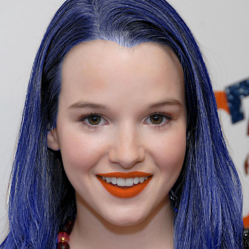
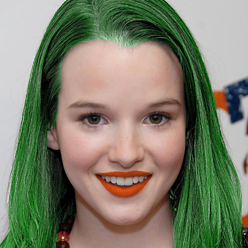
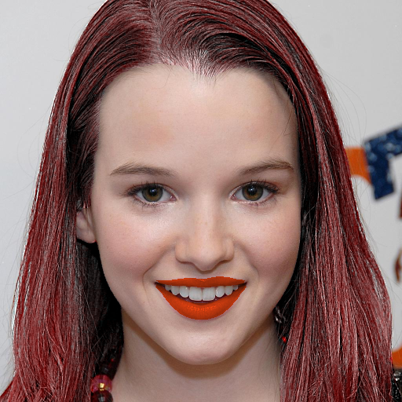

# face-makeup.PyTorch
Lip and hair color editor using face parsing maps.

<table>

<tr>
<th>&nbsp;</th>
<th>Hair</th>
<th>Lip</th>
</tr>

<!-- Line 1: Original Input -->
<tr>
<td><em>Original Input</em></td>
<td></td>
<td></td>
</tr>

<!-- Line 2: Color -->
<tr>
<td >Color</td>
<td></td>
<td></td>
</tr>

<!-- Line 3: Color -->
<tr>
<td>Color</td>
<td></td>
<td></td>
</tr>

<!-- Line 4: Color -->
<tr>
<td>Color</td>
<td></td>
<td></td>
</tr>

</table>

### Using PyTorch 1.0 and python 3.x

## Demo
Change hair and lip color:
```Shell
python makeup.py --img-path imgs/116.jpg
```
### Try to use other colors:
Change the color list in **makeup.py**(line 83)
```
colors = [[230, 50, 20], [20, 70, 180], [20, 70, 180]]
```
### Train face parsing model (optional)
Follow this repo [zllrunning/face-parsing.PyTorch](https://github.com/zllrunning/face-parsing.PyTorch)